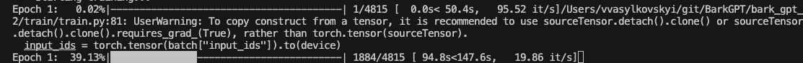
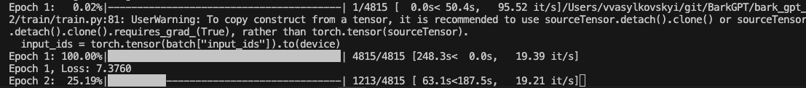
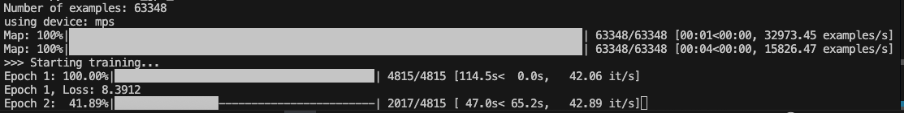

# Improving Training Time

Today we are going to deep dive into the training of the model. Previously we have trained our model using [Training BarkGPT on WebText‑2 dataset](./docs/02-training-on-webtext/README.md). We have observed that to train our model, even though the model is very small and the dataset is only 67k lines of raw text, the training per epoch would take a considerable amount of time. Why is that? Here we are going to dive into the training loop and see the optimization techniques.

## Prerequisites

To fully follow this article, I recommend understanding how the LLM is trained and built. This article is NOT another tutorial explaining how to setup langchain.

Here are the previous reads:

- [Building BarkGPT from scratch](./docs/01-building-from-scratch/README.md)
- [Training BarkGPT on WebText‑2 dataset](./docs/02-training-on-webtext/README.md)

## Demo

The model trained here is available online for you to try it out. It is small enough to run inferrence on my AWS EC2.

- [Live Demo](https://www.bark-slm.com) - Try it yourself - this is Bark Agent
- [Github Code is available in this repo in /app folder](https://github.com/vvasylkovskyi/BarkGPT/tree/main/app) - Check it out and run locally!

## My training time per epoch, and measuring time right



In the image below we can see that our training time per epoch took around 250 seconds which is roughly 4 minutes. Whether it is slow or not for LLMs in production, for my personal experiments it felt like alot of time wasted, especially given the fact that to effectively train a model we probably need a few epochs like that.

By the way, I had written a small script to measure time, before running my training loop. You can add it to your training loop. Here is the script:

```python
import time


def progress_bar(i, total, start_time, prefix=""):
    frac = (i + 1) / total
    bar_len = 40
    filled = int(bar_len * frac)
    bar = "█" * filled + "-" * (bar_len - filled)

    elapsed = time.time() - start_time
    rate = (i + 1) / elapsed if elapsed > 0 else 0
    eta = (total - (i + 1)) / rate if rate > 0 else 0

    print(
        f"\r{prefix}: {frac*100:6.2f}%|{bar}| "
        f"{i+1}/{total} "
        f"[{elapsed:5.1f}s<{eta:5.1f}s, {rate:7.2f} it/s]",
        end="",
        flush=True,
    )

    if i + 1 == total:
        print()


# The training loop
for epoch in range(epochs):
    total_loss = 0
    start_time = time.time()
    for index, batch in enumerate(train_loader):
        progress_bar(
            index,
            total=len(train_loader),
            start_time=start_time,
            prefix=f"Epoch {epoch+1}",
        )
        # Training loop goes here
    print(f"Epoch {epoch+1}, Loss: {total_loss/len(train_loader):.4f}")
```



## Contributing Factors to longer training time

From the screenshot it is evident that there are couple of factors contributing to longer training time:

1. The more epoch, the longer the training time
2. The bigger dataset, the longer training time, in particular, the more batches, the more training time.
3. Transformer forward+backward is cheap, each iteration is practically immediate

### Changing to MacOS GPU

I have been using the CPU for this experiment, but AI community is screaming for GPU. I don't own an Nvidia GPU, but my computer is MacOSX and I know there are Apple Silicon GPU - Metal GPU backend - also known as - MPS that stands for Metal Performance Shaders.

So how to change to GPU. Well, my original code seems to have some issues, since I have written the training loop by hand. There are couple of places where we have issues:

#### Moving Model to MPS

First, our code is never even setting device as MPS.

```python
device = "cuda" if torch.cuda.is_available() else "cpu" # device will never be MPS
model = BarkGPT(vocab_size=vocab_size, max_seq_len=block_size).to(device)
```

When we instantiate BarkGPT, the model weights are loaded into RAM by default. We then move them into device at the `.to(device)`. This means the model will live in the MPS. Let's change this bit to:

```python
device = (
    "mps"
    if torch.backends.mps.is_available()
    else "cuda" if torch.cuda.is_available() else "cpu"
)

print(f"using device: {device}")
model = BarkGPT(vocab_size=vocab_size, max_seq_len=block_size).to(device)
```

#### Moving the batched input_ids to mps

The `input_ids` - our tensors are started as CPU, and then moved to device at each batch training step. We can instantiate the `input_ids` immediately at MPS during the collation.

```python
def collate_fn(batch):
    # batch is a list of dicts: [{"input_ids": [...]}, ...]
    # Use the device here already - the mps
    input_ids = [torch.tensor(item["input_ids"], device=device) for item in batch]
    # pad sequences to the max length in this batch
    input_ids = pad_sequence(
        input_ids, batch_first=True, padding_value=tokenizer.pad_token_id
    )
    return {"input_ids": input_ids}


# The training loop
for epoch in range(epochs):
    total_loss = 0
    start_time = time.time()
    for index, batch in enumerate(train_loader):
        progress_bar(
            index,
            total=len(train_loader),
            start_time=start_time,
            prefix=f"Epoch {epoch+1}",
        )

        input_ids = batch["input_ids"] # Input ids are already on mps
        # Training loop goes here
    print(f"Epoch {epoch+1}, Loss: {total_loss/len(train_loader):.4f}")

```

Let's run the training again. As you can see, the epoch is now only 115 seconds -> roughly 2x improvement.



### Increasing Batch Size

The next obvious thing to do is increase the batch size. What are the implications?

- The bigger batch size, the more gpu memory is needed per batch
- training speed is expected to increase

Some not so obvious consequences of increasing batch size:

- [Large batch sizes can hurt generalization of the model](https://arxiv.org/pdf/1609.04836)
- [Train longer, generalize better: closing the generalization gap in large batch training of neural networks](https://arxiv.org/pdf/1705.08741) - with larger batches, the generalization can be preserved if training for longer epoch. Although our goal here is to speed up the training time, which wouldn't if we increase training epochs.
- [Don’t Decay the Learning Rate, Increase the Batch Size](https://arxiv.org/pdf/1609.04836) - some non-trivial techniques for learning rate fine-tunning might allow increased batch size.

### Increasing only batch size

I have changed the batch size from 16 to 128

```python
batch_size = 128

train_loader = DataLoader(
    lm_dataset,
    batch_size=batch_size, # batch size here
    shuffle=True,
    collate_fn=collate_fn,
)

for epoch in range(epochs):
    total_loss = 0
    start_time = time.time()
    for index, batch in enumerate(train_loader):

    ### Training goes here
```

From my run below below, we can observe is that the number of batches decreased as expected, but each batch time increased as well, which is expected because forward/backward scales with batch size, so bigger batches are slower per step. Overall I got marginal improvement in speed time, which doesn't justify on my current dataset. So I will remain with batch size at 16 for now.

```sh
Number of examples: 63348
using device: mps
Map: 100%|███████████████████████████████████████████████████████████████████████████████| 63348/63348 [00:01<00:00, 34107.61 examples/s]
Map: 100%|███████████████████████████████████████████████████████████████████████████████| 63348/63348 [00:03<00:00, 16285.86 examples/s]
>>> Starting training...
Epoch 1: 100.00%|████████████████████████████████████████| 602/602 [101.4s<  0.0s,    5.94 it/s]
Epoch 1, Loss: 8.6346
Epoch 2: 100.00%|████████████████████████████████████████| 602/602 [ 98.1s<  0.0s,    6.13 it/s]
Epoch 2, Loss: 7.5111
Epoch 3: 100.00%|████████████████████████████████████████| 602/602 [100.2s<  0.0s,    6.01 it/s]
```

### Increasing the batch size via gradient accumulation

We have observed that increasing the batch size to 128 didn't increase the training speed by much. One of the hypothesis is that it didn't work because of the overutilization of GPU cores, and effectivelly we ran out of GPU memory, which means some GPUs couldn't be used. So we need to scale the batch size back to make it smaller.

So I went with batch size 64, and I observed that the improvement was still marginal. Assuming that our gpu memory can't handle more than 64 batch size, what else can we do? enters the gradient accumulation.

**Gradient Accumulation**

The ideia of Gradient Accumulation is to improve the training speed reducing overhead of weight updates and gradient zeroing. Essentially we are going to run backward/forward for every mini-batch, but delay the weight update. This in practice feels like we are increasing the effective batch size.

So in practice the ideia is:

1. We keep the batch size small - 64 - enough to keep the gpu memory stable
2. We use the accumulation - lets say we want to accumulate 32 steps before optimizing.
3. effectively this means that 64 x 32 = 2048 - our effective batch size is 2048.

In code this will look like this

```python
batch_size = 64
# Gradient Accumulation
accum_steps = 32  # 64 x 32 = 2048 effective batch
effective_batch = batch_size * accum_steps

for epoch in range(epochs):
    total_loss = 0
    start_time = time.time()
    optimizer.zero_grad()  # reset gradients at epoch start
    for step, batch in enumerate(train_loader):
        # Minimal progress output
        progress_bar(
            step,
            total=len(train_loader),
            start_time=start_time,
            prefix=f"Epoch {epoch+1}",
        )

        input_ids = batch["input_ids"]
        # Next-token prediction
        inputs = input_ids[:, :-1]
        targets = input_ids[:, 1:]

        # -------------------------
        # Forward & backward
        # -------------------------
        logits = model(inputs)
        loss = loss_fn(logits.reshape(-1, vocab_size), targets.reshape(-1))
        loss = loss / accum_steps  # scale for accumulation
        loss.backward()

        # # Optional gradient clipping for stability
        # torch.nn.utils.clip_grad_norm_(model.parameters(), max_norm=1.0)

        # -------------------------
        # Step optimizer every accum_steps
        # -------------------------
        if (step + 1) % accum_steps == 0:
            optimizer.step()
            optimizer.zero_grad()

        total_loss += loss.item() * accum_steps  # scale back for logging

    print(f"Epoch {epoch+1}, Loss: {total_loss/len(train_loader):.4f}")
```

Notice that we compute `loss` on each iteration, but only run the optimizer after the accumulation steps are done. After doing some experimentation I came up with the number:

- batch_size: 64
- accum_steps: 32

Yielded best results. Notice the results below.

```sh
Number of examples: 63348
using device: mps
Map: 100%|███████████████████████████████████████████████████████████████████████████████| 63348/63348 [00:01<00:00, 40519.31 examples/s]
Map: 100%|███████████████████████████████████████████████████████████████████████████████| 63348/63348 [00:04<00:00, 15765.15 examples/s]
>>> Starting training...
Epoch 1: 100.00%|████████████████████████████████████████| 1204/1204 [ 81.8s<  0.0s,   14.72 it/s]
Epoch 1, Loss: 10.9480
Epoch 2: 100.00%|████████████████████████████████████████| 1204/1204 [ 81.3s<  0.0s,   14.80 it/s]
Epoch 2, Loss: 10.7994
Epoch 3: 100.00%|████████████████████████████████████████| 1204/1204 [ 82.1s<  0.0s,   14.66 it/s]
Epoch 3, Loss: 10.4300
```

There is an increase in speed - from 115s to 80s. But there is a problem, the learning loss is not decreasing as before, so effectively the learning is worse.

### Scaling Learning

The above phenomena is exactly what [Don’t Decay the Learning Rate, Increase the Batch Size](https://arxiv.org/pdf/1609.04836) explains. In practice, we have decreased the number of optimizer steps, and optimizer step is what applies the learning. The learning is governed by the learning rate at this line of code:

```python
optimizer = torch.optim.AdamW(model.parameters(), lr=3e-4)
```

The learning rate here is `3e-4`, so now what happens is that effectively instead of learning `3e-4` 32 times (one per `optimizer.step()`), we are learning only 1 time. So the learning decreased alot.

**How to improve the learning with gradient accumulations?**

If we scale the learning, then we might actually enjoy the large batch size and faster training speed.

**What is scaling learning?**

The tweak is pretty simple. To scale the learning, we have to increase the learning rate proportionally to the batch increase. This will mean, that even though we have fewer learning steps, each learning step is better.

So what we need to do is following:

```python
# Original lr = 3e-4 for batch_size=16 (or 64)
effective_batch = batch_size * accum_steps  # 64 * 32 = 2048
original_batch = batch_size                  # 64
lr_new = 3e-4 * (effective_batch / original_batch)
# lr_new = 3e-4 * (2048 / 64) = 3e-4 * 32 = 0.0096
optimizer = torch.optim.AdamW(model.parameters(), lr=lr_new)
```

The result, loss decreases again, and we have kept our training speed.

```sh
Scaled learning rate: 0.00960
Map: 100%|█████████████████████████████████████████████████████████████████████████████████████████████████████| 63348/63348 [00:01<00:00, 35389.53 examples/s]
Map: 100%|█████████████████████████████████████████████████████████████████████████████████████████████████████| 63348/63348 [00:03<00:00, 16138.69 examples/s]
>>> Starting training...
Epoch 1: 100.00%|████████████████████████████████████████| 1204/1204 [ 82.6s<  0.0s,   14.58 it/s]
Epoch 1, Loss: 8.1171
Epoch 2: 100.00%|████████████████████████████████████████| 1204/1204 [ 83.3s<  0.0s,   14.45 it/s]
Epoch 2, Loss: 6.6653
Epoch 3: 100.00%|████████████████████████████████████████| 1204/1204 [ 82.8s<  0.0s,   14.54 it/s]
Epoch 3, Loss: 5.9122
```

## Conclusion

So today we went on a deep dive into speeding up training for BarkGPT. From starting on CPU, moving to Mac MPS GPU, tweaking batch sizes, and finally experimenting with gradient accumulation and learning rate scaling, we saw firsthand how much these small but thoughtful changes can improve training efficiency.

The key takeaway? Training time isn’t just about faster hardware - it’s also about smarter loops, better utilization, and knowing how each tweak interacts with learning dynamics.

For small models like BarkGPT, these optimizations are crucial. They make experimenting faster, learning easier, and the whole development loop more enjoyable. Now, instead of waiting 4 minutes per epoch, we’re down to ~80 seconds—and the model is actually learning better!

Next up, I’ll explore even more advanced training tricks and maybe push BarkGPT to handle bigger datasets—because if we can make 67k lines fly, imagine what 10x that could do. Stay tuned!
