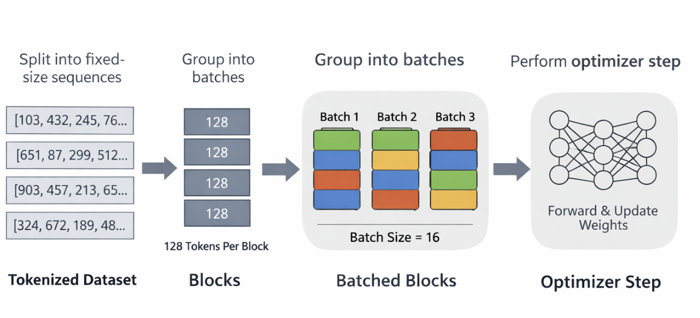

# Choosing the right parameters

Now it is the time to get our model better via better training.

## The baseline

Before defining the improvement, let's set the baseline. This will be our current state. Initial set of parameters:

```sh
Model parameters:
vocab_size=50257,
block_size=32,
n_layer=2,
n_head=2,
n_embd=32

Training parameters:
batch_size=16,
accum_steps=1,
effective_batch=16,
lr_small=0.0003,
lr_scaled=0.0003,
epochs=3
```

Training for 3 epochs provided the following loss:

```sh
Epoch 1: 100.00%|████████████████████████████████████████| 4815/4815 [120.4s<  0.0s,   40.00 it/s]
Epoch 1, Loss: 7.4985
Epoch 2: 100.00%|████████████████████████████████████████| 4815/4815 [120.2s<  0.0s,   40.04 it/s]
Epoch 2, Loss: 6.7005
Epoch 3: 100.00%|████████████████████████████████████████| 4815/4815 [119.2s<  0.0s,   40.39 it/s]
Epoch 3, Loss: 6.2980
```

As you can see, the loss continues decreasing alot, so we probably could have benefited with training for longer time. Finally, let's evaluate. For now we will do it manually, by looking at the text:

```sh
prompt = "the Jewish population"
Generated: , and the first "I, and the first "I, and the first of the universe, and the universe to the first "I, and the first of the first to the universe to the first first of the universe is the world, the first first of the first of the world, the world, and the first of the universe, and the universe, and the world, the United Kingdom of the first first first "I, and the first of the universe, the universe
```

It is still not great, but there is some structure.

## Improving Model

We have noticed that the loss was decreasing linearly, so we could have continued training for longer epoch. Let's try it with 30 epoch, 115s x 30 = 3350s ~= 55 minutes.

```sh
Epoch 1: 100.00%|████████████████████████████████████████| 4815/4815 [121.4s<  0.0s,   39.65 it/s]
Epoch 1, Loss: 7.4688
Epoch 2: 100.00%|████████████████████████████████████████| 4815/4815 [7267.0s<  0.0s,    0.66 it/s]]
Epoch 2, Loss: 6.6823
Epoch 3: 100.00%|████████████████████████████████████████| 4815/4815 [14068.3s<  0.0s,    0.34 it/s]]
Epoch 3, Loss: 6.2989
...
Epoch 27, Loss: 4.8682
Epoch 28: 100.00%|████████████████████████████████████████| 4815/4815 [146.0s<  0.0s,   32.99 it/s]
Epoch 28, Loss: 4.8543
Epoch 29: 100.00%|████████████████████████████████████████| 4815/4815 [148.1s<  0.0s,   32.51 it/s]
Epoch 29, Loss: 4.8396
Epoch 30: 100.00%|████████████████████████████████████████| 4815/4815 [134.2s<  0.0s,   35.88 it/s]
Epoch 30, Loss: 4.8266
```

The loss kept decreasing so we could have gained more. Probably would be a good idea to define some loss threshold, where we can estimate when it is no longer worth training for longer. Let's test again.

```sh
prompt = "the Jewish population"
Generated:  of the world's first time, and the United States, and the world's first presidency, and the world's first time, and the world's first term "The first term, and the world's first time, the United States, and the first-s, and the universe is a "a, the first-4] The New York Times, the world's first "The first-based learning is a "The first time, and the world's first-4]
```

It still is a bit confusing. Why is that?

## Making the GPT decoder

1. Parametrize to scale the model
2. Randomize the generation parameters
3. Train longer
4. Choose bigger dataset

## Guidelines of how to parametrize models better

## Tweaking parameters

1. If the model repeats → it’s capacity-limited:

- [The Curious case of neural text Degeneration](https://arxiv.org/pdf/1904.09751)

| Knob             | What it controls     | Symptoms when too small     |
| ---------------- | -------------------- | --------------------------- |
| `n_embd`         | Representation power | Repetition, generic phrases |
| `n_layer`        | Reasoning depth      | Shallow continuations       |
| `block_size`     | Memory               | Loses topic, loops          |
| `tokens trained` | Experience           | Overfits frequent n-grams   |

### The golden ratios (practical rules)

#### Width first, always. Increase `n_embd` before `n_layer`. Rule of thumb:

- [Kaplan et al., 2020 — Scaling Laws for Neural Language Models](https://arxiv.org/pdf/2001.08361)

```sh
n_embd ∈ {128, 256, 384, 768}
```

#### Head dimension rule

- [Vaswani et al., 2017 — Attention Is All You Need](https://arxiv.org/pdf/1706.03762)

Always keep:

```sh
head_dim = n_embd / n_head ≈ 64

# Examples
n_embd=256 → n_head=4
n_embd=384 → n_head=6
```

#### Depth rule

- [The Depth Delusion: Why Transformers Should Be Wider, Not Deeper](https://www.arxiv.org/pdf/2601.20994)
- [Depth-Width Tradeoffs for Transformers on Graph Tasks](https://arxiv.org/html/2503.01805v2)

Once width is reasonable:

```sh
n_layer ≈ n_embd / 64

# Examples
n_embd=256 → n_layer≈4–6
n_embd=512 → n_layer≈8
```

Too deep + small data = worse.

#### Context rule

- [Train Short, Test Long: Attention with Linear Biases Enables Input Length Extrapolation](https://arxiv.org/pdf/2108.12409)

Short context → repetition.

```sh
# Minimums.
block_size ≥ 128   (English)
block_size ≥ 256   (paragraphs)
```

#### Parameter count sanity check

- [Language Models are Few-Shot Learners](https://arxiv.org/pdf/2005.14165)

```sh
params ≈ 12 × n_layer × n_embd²
```

Before training, ask:

- Do I have enough tokens for this many params?

#### Chinchilla constraint (non-negotiable)

- [Training Compute-Optimal Large Language Models](https://arxiv.org/pdf/2203.15556)

```sh
tokens_seen ≥ 20 × params
```

If not:

- model memorizes
- repetition increases
- loss plateaus early

#### Generation settings - greedy decoding fails

- [Hierarchical Neural Story Generation](https://arxiv.org/pdf/1805.04833)

Must always sample

```sh
temperature = 0.8
top_k = 40
```

#### Safe Scaling Recipe

When you want to scale:

1. Pick `n_embd`
2. Set `n_head` = `n_embd` / 64
3. Set `n_layer` = `n_embd` / 64
4. Pick `block_size` ≥ 128
5. Ensure `tokens ≥ 20 × params`

## Let's design a training loop that will make smallest GPT non-looping (early GPT-1 vibes)

1. Smallest config we can have is as follows (based on the guideline above):

```python
GPTConfig(
    vocab_size = 50257,   # GPT-2 BPE
    block_size = 128,     # minimum usable context
    n_embd     = 128,     # absolute floor for English
    n_head     = 2,       # head_dim = 64
    n_layer    = 4        # shallow but enough
)
```

2. Let's count the parameters: ~ 0.8M Parameters

```sh
params ≈ 12 × n_layer × n_embd²
###
12 × 4 × 128²
= 786,432 params
```

3. Training requirements

```sh
tokens ≥ 20 × params
≈ 16 million tokens
```

4. Generation settings: must sample:

```sh
temperature = 0.8
top_k = 40
```

## Meetings chincilla requirements

Our current dataset contains `2,539,746` tokens. The dataset is 12MB: [WebText-2 from Hugging Face](https://huggingface.co/datasets/Raziel1234/WebText-2/tree/main). The calculation of tokens was done based on the following snippet:

```python
total_tokens = 0
num_lines = 0

with open(os.environ["DATASET_PATH"], "r", encoding="utf-8") as f:
    for line in f:
        tokens = tokenizer.encode(line)
        total_tokens += len(tokens)
        num_lines += 1


def tokenize(example):
    return tokenizer(example["text"])


dataset_tokens = dataset.map(tokenize, batched=False)

# Now compute total tokens
total_tokens = sum(len(x) for x in dataset_tokens["input_ids"])
print(f"Total tokens: {total_tokens}")
```

Our model has become 0.8M parameters, soo

```sh
tokens_needed ≈ 20 × params
20 × 800,000 = 16,000,000 tokens
2,539,746 / 16,000,000 ≈ 0.16 # 16% of the Chinchilla-recommended tokens
```

We completely under trained our model for its size. We have few options:

1. Get a larger dataset
2. Train for more epochs (more passes over same text -> more tokens seen). We would need to shuffle the dataset to avoid overfitting, which we do in `train.py`

```python
train_loader = DataLoader(
    lm_dataset,
    batch_size=batch_size,
    shuffle=True,       # <-- here is our shuffle
    collate_fn=collate_fn,
)
```

### Getting OpenWebText Open Source

Open Web Text is an open source reproduction of a dataset used to train OpenAI GPT-2, as discussed in [GPT-2 paper](https://cdn.openai.com/better-language-models/language_models_are_unsupervised_multitask_learners.pdf). This dataset can be found here - [OpenWebText](https://skylion007.github.io/OpenWebTextCorpus/) dataset

Let's download it using `datasets` library.

```python
from datasets import load_dataset

ds = load_dataset("Skylion007/openwebtext")
```

### Training on OpenWebText

I started my training loop as before:

```sh
plain_text/train-00000-of-00080.parquet: 100%|████████████████████████████████████| 303M/303M [00:09<00:00, 32.6MB/s]
plain_text/train-00001-of-00080.parquet: 100%|████████████████████████████████████| 306M/306M [00:10<00:00, 29.3MB/s]
plain_text/train-00002-of-00080.parquet: 100%|████████████████████████████████████| 304M/304M [00:09<00:00, 31.4MB/s]
plain_text/train-00003-of-00080.parquet: 100%|████████████████████████████████████| 304M/304M [00:07<00:00, 38.4MB/s]
...
```

There are [80 plain text files](https://huggingface.co/datasets/Skylion007/openwebtext/tree/main/plain_text), each ~300MB size wich totals into roughly 24 GB of text. That is alot of text comparing to our first reduced Open Web Text of 12MB. Surely Chinchilla will be ok here.

For each of this file, it takes 8 seconds to tokenize, which 8 x 80 = 320s ~= 5minutes just to tokenize. Then to collate, another 5 minutes. Roughly larger dataset bring new problems, e.g., we need to start caching our tokenizer. More on this later.

After finishing tokenizing, I can finally see how many tokens we have. The new amount of tokens is ~6 billion. Chincilla is 20 × 0.8M = 16M tokens. Our new dataset satisfies the equation 375 times.

```sh
6B tokens / 16M tokens ≈ 375
```

Surprisingly I also see new lines saying: "Generating train split".

```sh
plain_text/train-00079-of-00080.parquet: 100%|████████████████████████████████████| 303M/303M [00:08<00:00, 36.4MB/s]
Downloading data: 100%|███████████████████████████████████████████████████████████| 80/80 [11:19<00:00,  8.49s/files]
Generating train split:  62%|██████████████████████▏             | 4933437/8013769 [01:06<00:39, 78219.78 examples/s]
Loading dataset shards: 100%|████████████████████████████████████████████████████████| 80/80 [00:17<00:00,  4.55it/s]
```

This didn't appear before on small dataset. Hugging faces is smart to understand that large datasets take time and it caches them. After this first run, HF will save the cached version in `~/.cache/huggingface/datasets/...`.

### Adding Chincila dataset check

We can add a script to programatically calculate the number of tokens, and see if we pass the chincilla check given our model size. Example snipet below:

```python
def tokenize(batch):
    return tokenizer(
        batch["text"],
        truncation=True,
        max_length=256,
        return_attention_mask=False,
    )


tokenized_dataset = dataset.map(tokenize, batched=True, remove_columns=["text"])

# -----------------------------
# 4. Count total tokens
# -----------------------------
total_tokens = sum(len(x) for x in tokenized_dataset["input_ids"])
avg_tokens_per_example = total_tokens / len(tokenized_dataset)

print(f"Number of examples: {len(tokenized_dataset)}")
print(f"Total tokens: {total_tokens}")
print(f"Average tokens per example: {avg_tokens_per_example:.2f}")

# -----------------------------
# 5. Chinchilla check
# -----------------------------
# Replace with your model params
model_params = 800_000  # e.g., 0.8M

tokens_needed = 20 * model_params
print(f"Tokens needed per Chinchilla: {tokens_needed}")

# Compute minimum epochs needed
min_epochs = math.ceil(tokens_needed / total_tokens)
print(f"Minimum epochs to satisfy Chinchilla: {min_epochs}")

if epochs < min_epochs:
    print(
        f"Warning: Current epochs ({epochs}) is less than Chinchilla minimum ({min_epochs}). Consider increasing epochs."
    )
else:
    print("Chinchilla training requirement satisfied.")
# -----------------------------
```

### Blocks and Optimizer Steps


During training, we split the dataset into blocks of fixed length (block_size), e.g., 128 tokens per block. Each block becomes a single training example for next-token prediction, which allows batching and keeps memory usage manageable.

We then compute optimizer steps — how many times the model weights are updated per epoch:

```sh
# -----------------------------
# 5. Compute number of blocks
# -----------------------------
block_size = model_config.block_size
num_blocks = total_tokens // block_size
avg_tokens_per_block = block_size  # by design each block has block_size tokens

print(f"Number of blocks (block_size={block_size}): {num_blocks}")
print(f"Average tokens per block: {avg_tokens_per_block}")

# -----------------------------
# 6. Compute steps per epoch
# -----------------------------
batch_size = training_parameters.batch_size
accum_steps = training_parameters.accum_steps  # gradient accumulation

steps_per_epoch = math.ceil(num_blocks / batch_size / accum_steps)
tokens_per_step = batch_size * block_size  # tokens seen per step

print(f"Steps per epoch (with accumulation={accum_steps}): {steps_per_epoch}")
print(f"Tokens per optimizer step: {tokens_per_step}")

# -----------------------------
# 8. Chinchilla scaling check
# -----------------------------
tokens_needed = 20 * model_params
min_epochs = math.ceil(tokens_needed / total_tokens)
total_optimizer_steps = min_epochs * steps_per_epoch

print(f"Chinchilla tokens required: {tokens_needed:,}")
print(f"Minimum epochs to satisfy Chinchilla: {min_epochs}")
print(f"Total optimizer steps to reach Chinchilla: {total_optimizer_steps}")
```

Estimating blocks and steps is essential to:

1. Plan training duration and batch sizes.
2. Scale the learning rate correctly with gradient accumulation.
3. Ensure the model sees enough tokens to satisfy Chinchilla and learn effectively.
4. Without this, we risk undertraining or inefficient use of compute.

## Training for a long time

Some insights you can only get after you start practice. With Open Web Text 2, macbook spent 2 hours, and failed at the end of the run. In addition, according to the calculation, there are nearly 1 million optimizer steps, with 1-4 steps per second it is nearly a week of non stop training. What if the process fails again mid training?

A good practice to circumvent the pains of failed training is frequent checkpointing. We have been doing checkpoint already, only 1, at the end of all training:

```python
torch.save(
    {
        "model_state": model.state_dict(),
        "vocab_size": model_config.vocab_size,
        "max_seq_len": model_config.block_size,
    },
    "bark_gpt_2_model.pt",
)

tokenizer.save_pretrained("bark_gpt_2_tokenizer")
```

There are few things we can do to improve our training crash safety:

1. Save checkpoint of training at every `N` optimizer steps. For instance, every 500-2000 steps.
2. Save tokenized dataset into cache to avoid mapping again in case of failure

### Saving Checkpoing of training at every `N` steps

First, we will define the save function

```python
import os
import torch
import torch.nn as nn

CKPT_PATH = "checkpoints/barkgpt_ckpt.pt"
os.makedirs("checkpoints", exist_ok=True)

def save_checkpoint(
    epoch: int, step_in_epoch: int, model: nn.Module, optimizer: torch.optim.Optimizer
):
    tmp = f"{CKPT_PATH}.tmp"
    torch.save(
        {
            "epoch": epoch,
            "step": step_in_epoch,
            "global_step": global_step,
            "model": model.state_dict(),
            "optim": optimizer.state_dict(),
        },
        tmp,
    )
    os.replace(tmp, CKPT_PATH)
```

Note, above we are saving into temp folder first, to avoid crash mid-write. This is atomic write this way.

Next, we going to add a load checkpoint before the training loop:

```python
start_epoch = 0
global_step = 0
start_step = 0

## Resume from checkpoint if available
if os.path.exists(CKPT_PATH):
    ckpt = torch.load(CKPT_PATH, map_location=device)
    model.load_state_dict(ckpt["model"])
    optimizer.load_state_dict(ckpt["optim"])
    start_epoch = ckpt["epoch"]
    start_step = ckpt["step"]
    global_step = ckpt["global_step"]
    logger.info(f"Resumed from epoch {start_epoch}, step {global_step}")
```

And finally, we will modify our training loop slightly to start from `start_epoch` and save on every `x` iteration:

```python
for epoch in range(start_epoch, epochs):
    total_loss = 0
    start_time = time.time()

    for step, batch in enumerate(train_loader):
        # skip until we reach the saved step
        if epoch == start_epoch and step < start_step:
            continue

        ...

        loss.backward()

        if (step + 1) % accum_steps == 0:
            optimizer.step()
            optimizer.zero_grad()

            global_step += 1

            if global_step % 2 == 0:
                save_checkpoint(epoch, step, model, optimizer)

```

As a quick test I was able to store and resume from checkpoint:

```sh
2026-02-01 22:30:37 [INFO][train] Resumed from epoch 0, step 76
Epoch 1:   6.23%|██--------------------------------------| 77/1236 [  1.1s< 16.8s,   68.82 it/s]2026-02-01 22:30:38 [INFO][train] Saving checkpoint at epoch 0, step_in_epoch 75, global_step 78
```

### Saving tokenized dataset into cache

The next quick improvement is to cache the tokenized dataset. This is useful because on big datasets like Open Web Text 2, the tokenization of dataset might take hours. So this way we avoid waiting extra hours in case something goes wrong, and we can trully resume from the last point in time.

All we need to do is write a small script to store the dataset on disk: `load_dataset_from_cache`:

```python
def load_dataset_from_cache():
    CACHE_DIR = "cache/lm_dataset"

    if os.path.exists(CACHE_DIR):
        logger.success("Loading tokenized + grouped dataset from disk")
        lm_dataset = load_from_disk(CACHE_DIR)

    else:
        logger.info("Building tokenized + grouped dataset (one-time)")
        lm_dataset = tokenized_dataset.map(
            group_texts,
            batched=True,
        )

        lm_dataset.save_to_disk(CACHE_DIR)
        logger.info("Dataset saved to disk")

    return lm_dataset


lm_dataset = load_dataset_from_cache()
```

`Dataset` object already has the `save_to_disk`, so it is literally only that. Next time, when we resume from our checkpoint, we can see that everything worked as a charm:

```sh
2026-02-01 22:40:44 [SUCCESS][train] Loading tokenized + grouped dataset from disk
2026-02-01 22:40:44 [SUCCESS][train] Resumed from epoch 0, step 94
Epoch 1:   7.52%|███-------------------------------------| 93/1236 [  0.9s< 10.7s,  107.01 it/s]
```

### Avoiding Loss exploding into NaN by early validation

It might happen that the loss went unstable, logits become large and loss function computes `NaN` which means learning went wrong. To early catch such situation, we can compute loss at the checkpoint time and NaNs/infs are caught early so we can stop or debug before the model explodes.

We can also add a running loss, where we can inspect the loss at each step

```python
def sanity_loss(model, loss_fn, sample_batch):
    model.eval()  # disable dropout / training effects
    with torch.no_grad():  # do NOT compute gradients
        inputs = sample_batch[:, :-1]
        targets = sample_batch[:, 1:]
        logits = model(inputs)
        loss = loss_fn(
            logits.reshape(-1, model_config.vocab_size),
            targets.reshape(-1)
        ).item()
    model.train()  # restore training mode
    return loss

if global_step % checkpoint_interval == 0:
    ckpt_loss = sanity_loss(model, loss_fn, input_ids)  # small batch
    logger.info(f"Checkpoint at step {global_step}: sanity loss={ckpt_loss:.4f}")
```

## After Training Result

After training my model for 5 days with 1 epoch I got the following output:

```sh
2026-02-06 13:40:23 [SUCCESS][TrainingManager] Epoch 1, Loss: 10.9859
2026-02-06 13:40:23 [INFO][ModelCheckpointsManager] Saving checkpoint at epoch 1, step_in_epoch 0, global_step 1
2026-02-06 13:40:24 [SUCCESS][train] Training complete.

# Generation
2026-02-06 13:38:17 [INFO][test_gen] Generated:  has been a new ‘the house.
The video on the United States of the next week, and other, the time for a two dozen at the country's 'myster that is a good for the first, the country, it was one, which also is one of the second year. The city in the world-state, which have a new information regarding it would be a very high-year-time in the city, and his team is not for it is
```

This is way better than before:

```sh
prompt = "the Jewish population"
Generated:  of the world's first time, and the United States, and the world's first presidency, and the world's first time, and the world's first term "The first term, and the world's first time, the United States, and the first-s, and the universe is a "a, the first-4] The New York Times, the world's first "The first-based learning is a "The first time, and the world's first-4]
```

Notably, there is no repetition collapse .
